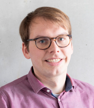

Mein Name ist Niklas Bulk. Ich habe Wirtschaftsingieurwesen mit dem Schwerpunkt Kommunikationstechnik an der [HAW Kiel](https://www.haw-kiel.de/startseite/) im Bachelor sowie im Fernstudium an der [Hochschule WINGS](https://www.wings.hs-wismar.de/de) in Wismar im Master studiert. Meine Promotion habe ich im Juli 2026 an der Universität Bremen abgeschlossen.

- Bachelorarbeit (2017): "Entwicklung und Optimierung eines breitbandigen Phasenschiebers im GHz Bereich" 
- Masterarbeit (2020): "Implementation of a 5G URLLC Simulation Software in Python"
- Doktorarbeit (2026): "Multi-Service Composition using Tailored MCS for Industrial Wireless Communication"

Ich bin als wissenschaftlicher Mitarbeiter an der [Universität Bremen](https://www.uni-bremen.de) im [Arbeitsbereich Nachrichtentechnik](https://www.ant.uni-bremen.de) (ANT) tätig. 
Mein Schwerpunkt liegt auf industriellen Funknetzen und ihrer Integration in Campusnetze.
Am ANT habe ich mich insbesondere mit serviceorientierter Kommunikation beschäftigt.
Dabei betrachten wir nicht das Netzwerk als Ganzes, sondern die Anforderungen einzelner Services an die Kommunikation.
Je nach Anwendung unterscheiden sich diese Anforderungen beispielsweise hinsichtlich Zuverlässigkeit, Latenz oder Datenrate.
Das Campusnetz muss darauf entsprechend reagieren können.
Ich bin überzeugt, dass dieser Gedanke auch für zukünftige agentische KI-Systeme an Bedeutung gewinnen wird.
Wenn mehrere KI-Agenten miteinander und mit technischen Systemen interagieren, werden auch sie unterschiedliche Anforderungen an die zugrunde liegende Kommunikation stellen.
Netzwerke müssen diese Anforderungen erkennen und sich dynamisch daran anpassen können.
Neben den fachlichen Kenntnissen habe ich während meiner Arbeit am ANT vor allem Erfahrung in der Entwicklung reproduzierbarer Simulationen, im zielgruppengerechten Schreiben wissenschaftlicher und nichtwissenschaftlicher Texte sowie im abstrakten Denken und Visualisieren gesammelt.

In meiner Freizeit spiele ich Tuba im [Ocherster der Universität Bremen](https://www.uni-bremen.de/orchester-chor), hier versorge ich die Brass-Section neben tiefen Tönen auch mit guten [Dad-Jokes](/dad-jokes). Daneben segel ich gerne bei der [Segelgemeinschaft der Uni](https://www.sub-bremen.de/) und auf den niederländischen Binnenmeeren.
Lesen ist ein weiteres Hobby von mir.
In der Zukunft werde ich auch Buchbesprechungen hier veröffentlichen.
